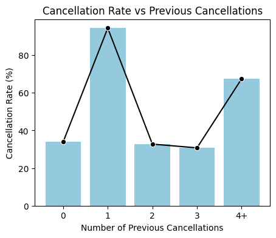
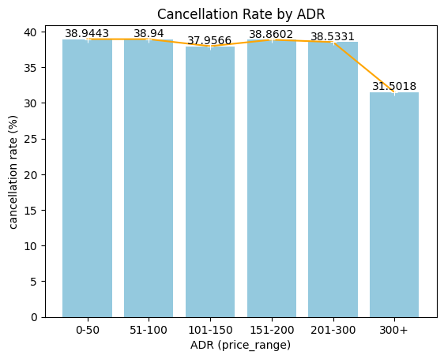
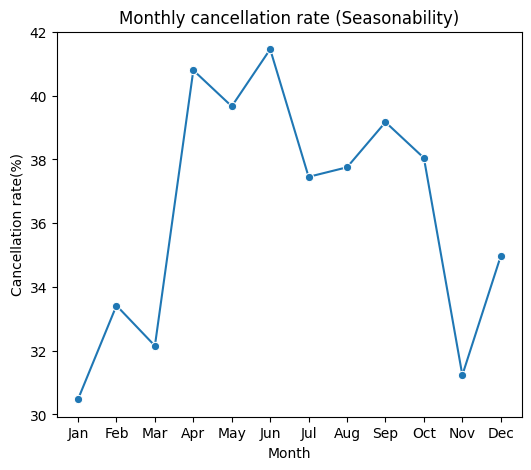

# 🏨 Hotel Booking Cancellation Analysis (EDA)

## 📌 Project Overview
This project performs exploratory data analysis on hotel booking data to understand the key factors influencing booking cancellations and to derive actionable business insights.

---

## 📊 Dataset
The dataset contains hotel booking information such as lead time, deposit type, customer behavior, pricing (ADR), and arrival month.

---

## 🎯 Objectives
- Understand cancellation behavior
- Identify high-risk booking patterns
- Support pricing and cancellation policy decisions

---

## 🛠 Tools Used
- Python
- Pandas
- NumPy
- Matplotlib
- Seaborn
---

## 📈 Key Analyses & Insights

### 1️⃣ Lead Time vs Cancellation
Long lead-time bookings show a higher cancellation rate compared to short lead-time bookings.

---

### 2️⃣ Deposit Type vs Cancellation
Bookings without a deposit have the highest cancellation risk, while deposit policies help protect revenue.

---

### 3️⃣ Previous Cancellations vs Cancellation
Even one previous cancellation significantly increases the likelihood of future cancellation.

---

### 4️⃣ ADR vs Cancellation
Cancellation rates remain stable across low–mid prices and decrease for very high ADR bookings.

---

### 5️⃣ Seasonality vs Cancellation
Cancellation behavior shows clear seasonal patterns, with higher risk during mid-year months.

